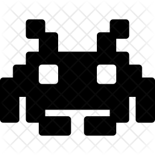
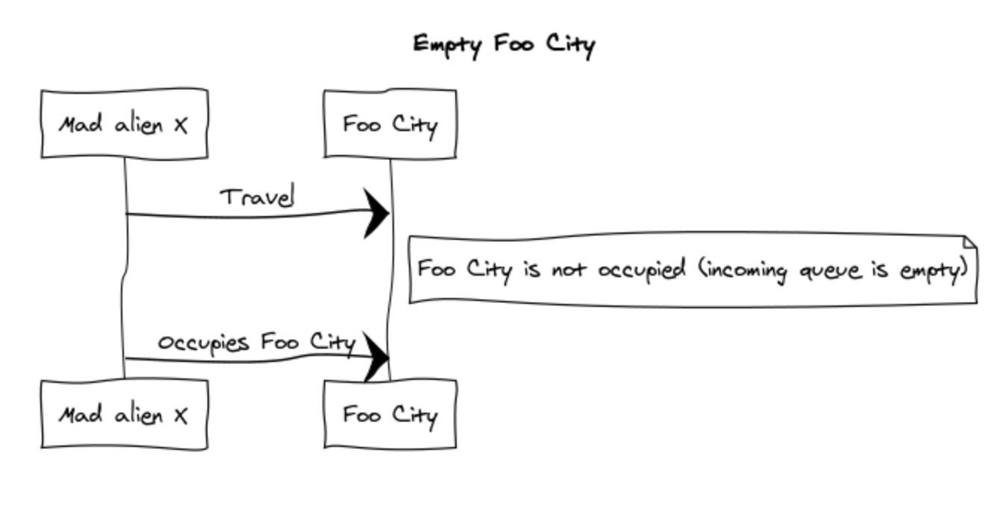
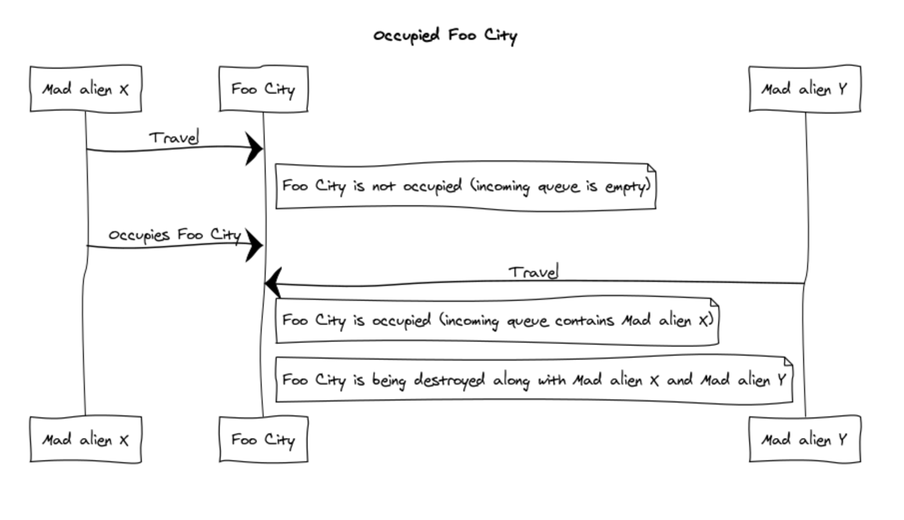
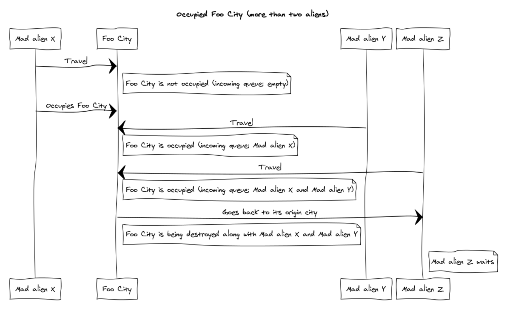

# Mad Aliens  

Mad aliens are about to invade the earth and I simulated the invasion. The detailed description of the task is located in `documents/alien_invasion.pdf`.

## The assumptions

The only assumption that I made is the following:
* Alien travels to the city and if the war is already there it goes back immediately to its origin city. Previous operation is propagated to the whole graph.

The situation is illustrated in the following diagrams.

<p align="center">
    
</p>

On the sequence diagram above we can see a normal situation where the city is empty. The alien occupied the city.

<p align="center">
    
</p>

On the sequence diagram above we can see a situation we just two aliens. The city is being destroyed.

<p align="center">
    
</p>

On the sequence diagram above we can see a situation with three aliens. Alien Z is going back to its origin city since it noticed the war between Alien X and Alien Y.
The pattern is being propagated to all the cities sorted by their incoming queue size. 

#### Note: In order to be more interesting I added one more move to the alien and that's WAIT.

### Prerequisites

In order to run the simulation you need to install Go (https://golang.org). This application is built with `Go v1.13.1` with modules enabled.

### Installing

In order to build the application use the following command:

```make install```

This command will create `mad_world` executable in the root folder. Use `./mad_world --help` to see the arguments for the executable.
The executable accepts the following arguments:

```
     Usage of ./mad_world:
     -aliens int
           number of aliens
     -debug
           number of aliens
     -iterations int
           maximum iterations per alien (default 10000)
     -path string
           path to file containing cities
``` 

## Running the tests

Tests are located in the `tests` directory. In order to run test start the following command:

```make test```

Tests are created by creating a custom world in the `cities.txt` and predefined aliens path in `aliens.txt`. 
Expected result is located in `expected.txt`.

Example:
```

### cities.txt content:

A east=B
B west=A east=C
C west=B east=D
D west=C

### aliens.txt content:

1=A east
2=B wait
3=C west
4=D west

### expected.txt content:

alien 1 tries to move from A to B
alien 2 is waiting
alien 3 tries to move from C to B
alien 4 tries to move from D to C
B has been destroyed by alien 1 and alien 2!
alien 3 reporting! mad aliens already fighting! going back to C
C has been destroyed by alien 3 and alien 4!
all aliens are dead or stuck

```

#### Note: tests are run in `DEBUG` mode.

## Built With

* [Go](https://golang.org)

## Authors

* **Janko Simonovic** - [LinkedIn](https://www.linkedin.com/in/jsimonovic/)

## License

This project is licensed under the MIT License - see the [LICENSE](LICENSE) file for details